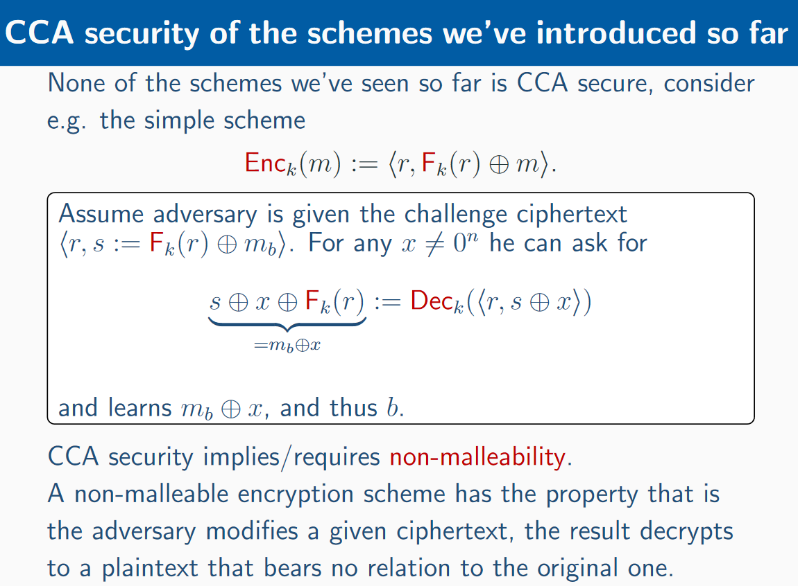
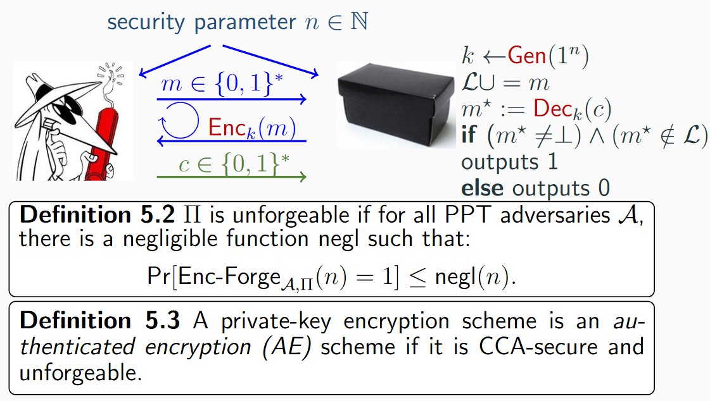
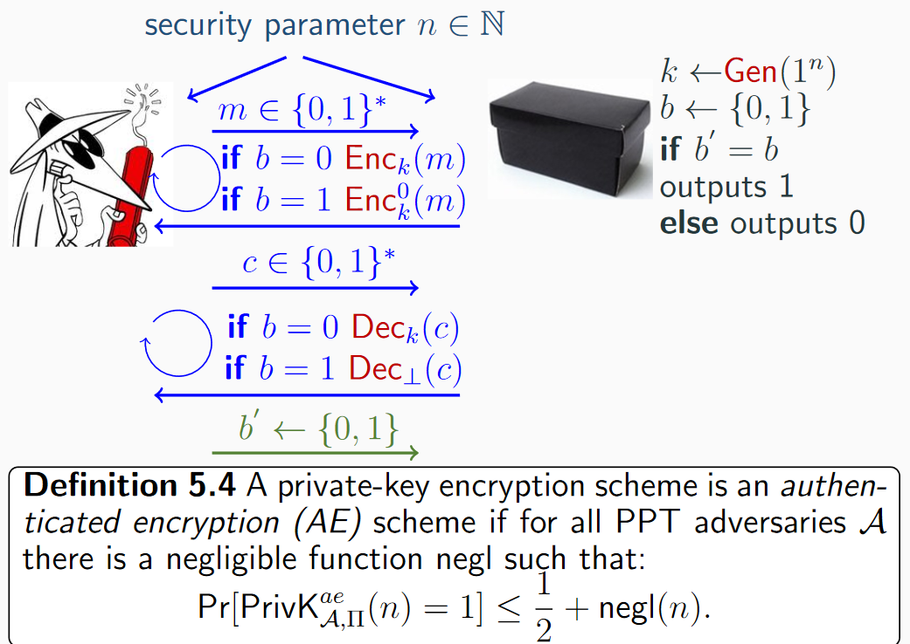
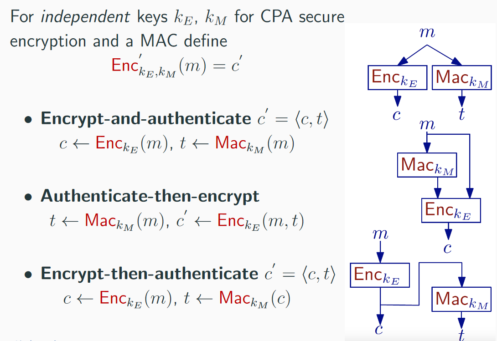
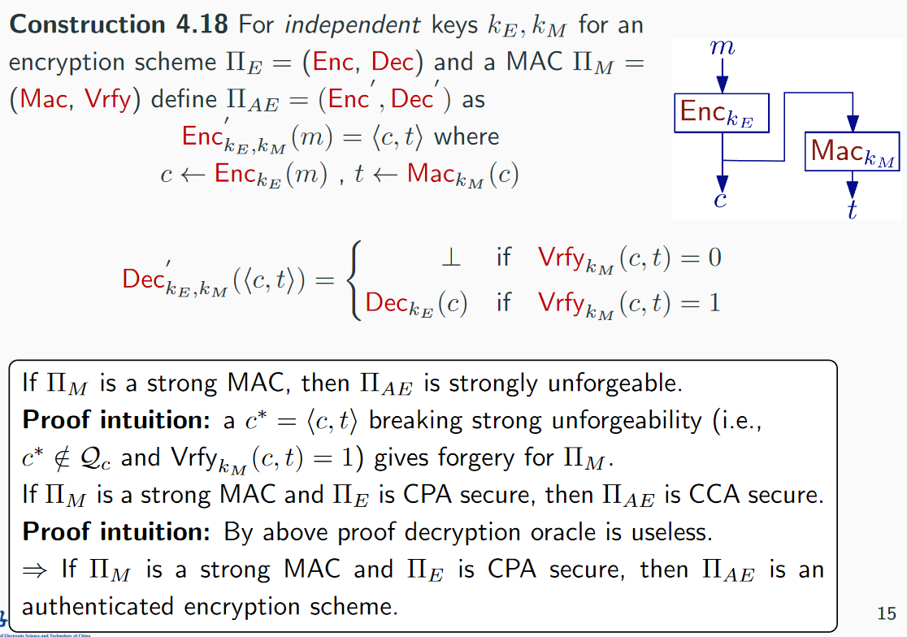

## 选择密文攻击

Chosen Ciphertext attacks

敌手可以篡改密文

## Padding-oracle attacks

填充位攻击

CBC加密模式，只能是 n*l长的明文，缺失的需要填充，最后x位都是x（比如9个9）

攻击者通过CBC内部修改padding值，而解密预言机如果最后一个数据块不对就会抛出填充异常，通过异常值再修改最后一个数据块就可以使用密文逐比特推出明文。

[wiki Padding oracle attacks](https://en.wikipedia.org/wiki/Padding_oracle_attack)

## CCA-Security

CCA安全是在不可展性non-malleability的前提下，即使密文更改1比特，明文也完全不同

## Authenticated encryption

认证加密，既有CCA保密性，也有完整性

不可伪造性Unforgeability（由低到高）：随机明文不可伪造，选择明文不可伪造，存在不可伪造（Existential Unforgeability，这里选择的，敌手请求信息能返回一个合法密文（不需要对应明文）就算成功）

这里对两个认证加密的定义是相同的

**定理5.5** 一个私钥加密算法模式满足5.4当且仅当其满足5.3

AEAD（Authenticated encryption with assoiciated data）对密文的安全性、完整性保证，而且可对未加密的关联数据提供完整性保证

任何的AE加密模式都是CCA安全的，反之则不然。CCA安全没有考虑数据的完整性，只是保证在通信双方信道中有敌手时的安全性，AE同时保证安全性和完整性。

*注意：即使是安全的密码学原语，组合起来也不一定是安全的

## 三种AE构造

### Encrpt and Authenticate

使用两个密钥分别产生密文和tag

- 不能保证安全性，tag可能暴露明文
- 如果使用确定性的MAC算法（比如CBC-MAC），不能保证CPA安全。只要第二次发送相同明文，就会暴露。

### Authenticate then Encrypt

使用两个密钥，先计算MAC，然后加密明文和tag产生密文

一般而言此处加密算法不是CCA安全，可以被 padding oracle attack。

总体来说不错，IPsec也是用的这个。

但是如果算法不返回错误是由于padding error，可以解决（比如SSL只返回一种错误提示）

SSL也不能完全是安全的，只提供一种异常信息是不合理的，而且攻击者也可以通过不同的方式（比如异常时间）来判断错误原因

### Encrypt then Authenticate

*独立的密钥：使用不同的密码学原语一定要使用独立的密钥

标准化方案：GCM，CCM，ChaCha20-Poly1305

## Secure communication sessions

- Re-ordering attack：重排序攻击，对发送信息的顺序进行调换
- Replay attack：重放
- Message-dropping attack：删去部分信息
- Reflection attack：可以把A发给B的消息再发给A