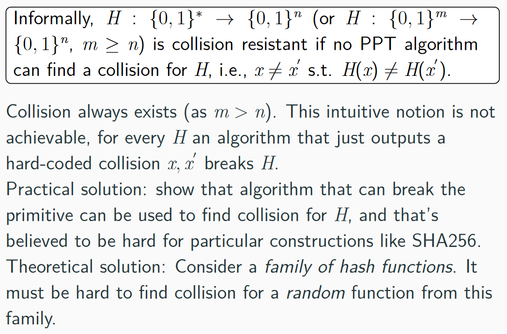
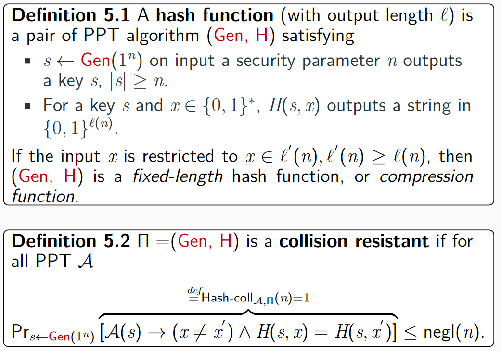
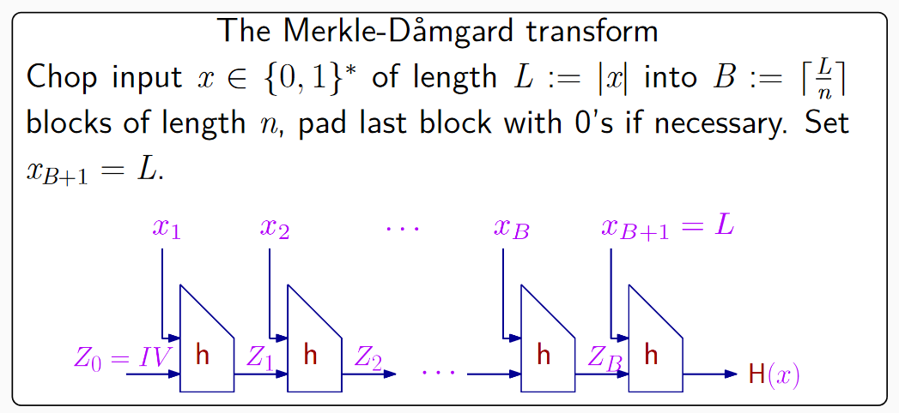
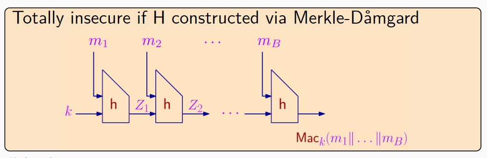
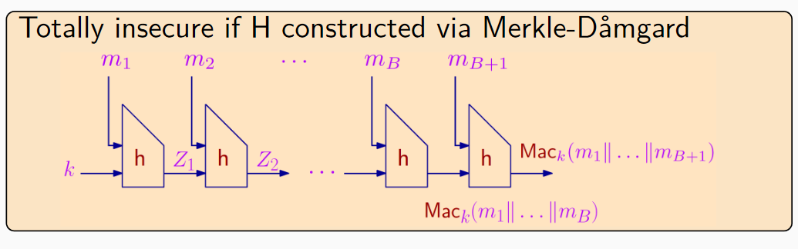
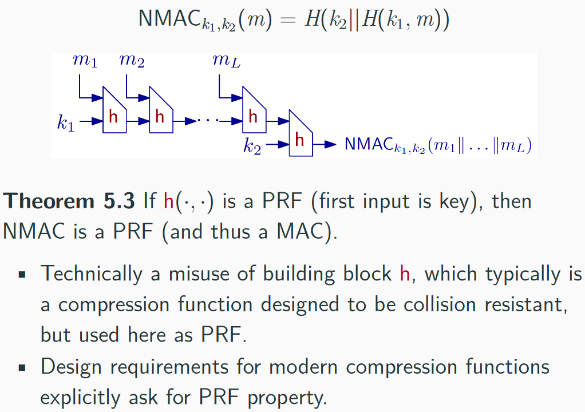
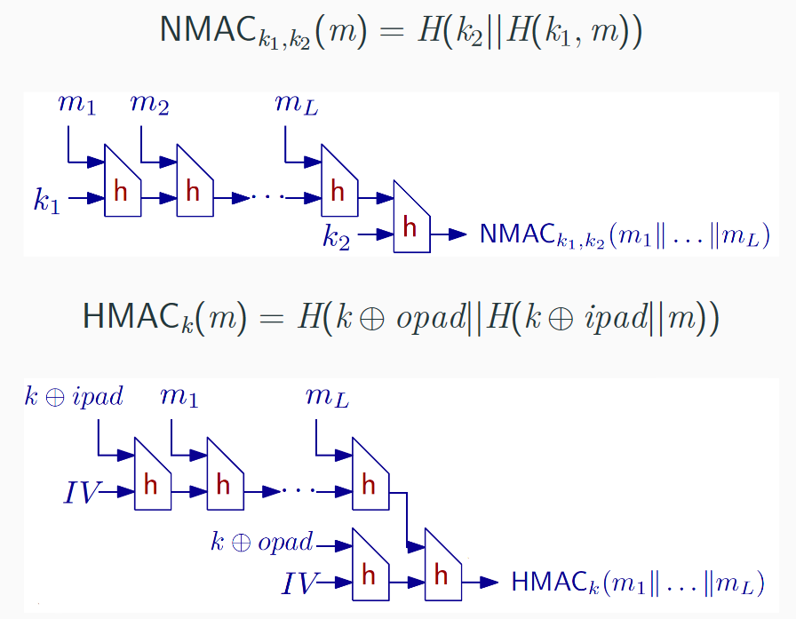

Hash两个功能：压缩&抗碰撞

## Collision Resistance

抗碰撞

- 碰撞是一定存在的
- 实践中的解决办法：找到碰撞是困难的
- 理论方法：考虑一系列的哈希函数，找到碰撞是困难的

### 更弱的哈希安全

1. Second-preimage or target-collision resistance：给出s和随机串x，很难找到$x' \neq x 使得 H(s,x)=H(s,x')$
2. preimage resistance or one-wayness：给出s和哈希结果y，很难找到x'使得 H(s,x')=y，无所谓x和x'是否相等

## Domain extension for CRHFs

实际上，哈希函数是一个压缩的函数，对任意长的数据压缩为同样长的哈希值

注意最后一块需要是 $x_{B+1}=L$，如果不是，则可以在第B块中构造碰撞（B块上需要补0）

H(xxx|0000) = H(xxx000|0)

**定理5.4** 如果h是抗碰撞的，则H是抗碰撞的

证明：对于$x \neq x',H(x)=H(x')$，可以有效地找出一个h的碰撞

……

## Hash and MAC

构造与证明

### Using hash functions as MACs

- 实现哈希函数更快
- 使用起来不需要太多密码学知识

直接使用是不安全的

安全性较低

### HMAC

HMAC是实际中用的较多的NMAC变体

- 只使用一个密钥，通过和固定的ipad，opad进行异或生成两个key
- 可以使用固定的IV
- 安全性证明需要h的假设，不仅仅是PRF

## Generic attacks

对所有哈希函数的一些通用攻击

证明及计算

## 哈希函数的应用

### Random oracle model

随机预言机模型

RO: Random Oracle

RO方法methodology

- 方法在RO下进行设计和安全性证明
- 现实中，RO就是密码学哈希函数的实例

RO不是一个证明，只是一个假想，没有真正的证明，但总比没有证明好

oracle就是一个黑盒，以一个比特串为输入，输出一个比特串，黑盒内部是未知的

具有一致性consistent，即如果有相同的输入，则repeat之前的输出

- 如果x没有查询过，H(x)是uniform
- if A进行了x的查询，则reduction sees this query
- 可编程性Programmability，归约可以program H(x)来输出一个uniform值

对ROM的反对

- 没有严格规范的证明来说明ROM下的证明在真实世界的安全性
- 一旦使用一个确定的hash来替换RO，则敌手可以自己构造一个H，因此归约就无法得到敌手A的查询了，无法继续证明了
- 我们不知道一旦使用一个确切的hash函数来实例化RO意味着什么

支持：

- 总比没有证明好
- 在ROM下证明的方法被大家看到了，对方法的实例化的攻击就是由RO的实例化hash函数的缺陷产生的攻击
- 没有对在ROM下安全的方法的成功过的攻击，只要ROM恰当的实例化

### Fingerprinting and duplication

数据指纹及去重

- 病毒查找：使用hash对照，查找计算机病毒
- 去重：云存储，相同hash只存一个

### Merkle  Tree

hash指针，文件的hash再hash

### Basic password prototcol

数据库中存储hash值，不能明文存储密码